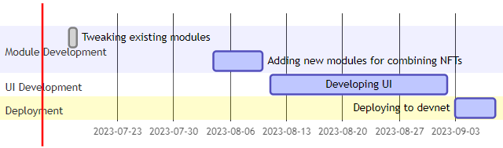

# Product Sheet

- Will only support Token V2 for now

## Initial Structure

### Off-chain

These are the functionalities that will be implemented off-chain.

#### Marketplace

- Combine listed NFTs to get overview of the end product.

#### Studio

- Combine owned NFTs to get overview of the end product.

### On-chain

#### Marketplace

(forking move-examples/marketplace.move)
- Buy/Sell NFTs.
- Auction NFTs.
> Class Diagrams will be implemented upon discussing the structure explictly.

#### Studio

(using move-examples/object-token/hero.move as a reference)
- Combine NFTs: Un/equip NFT to another NFTs.
> Class Diagrams will be implemented upon discussing the structure explictly.

## Schedule

- Tweaking existing contracts: 17.07 -> 19.07
- Adding new contracts for combining NFTs: 04.08 -> 10.08
- Developing UI: 11.08 to 02.09
- Deploy on devnet: first week of September
- Audit contracts. After the hackathon
- Deploy on mainnet. To be discussed.

