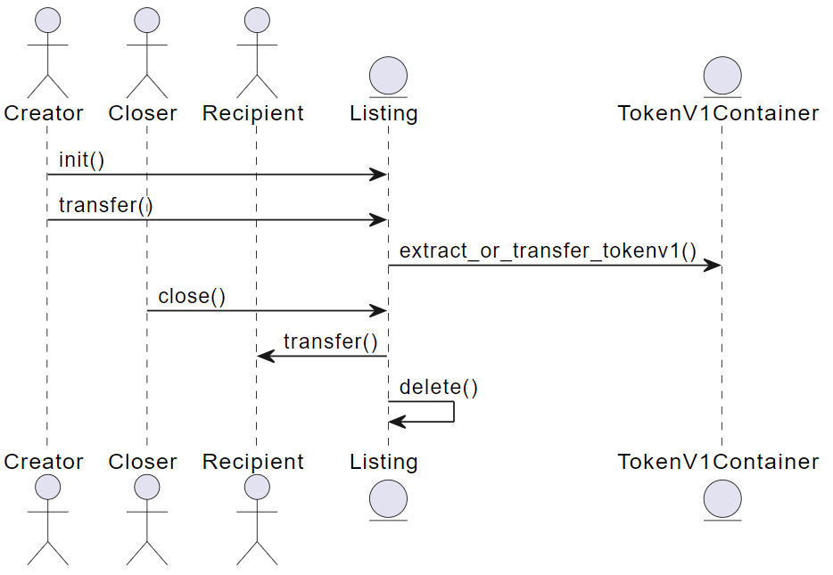
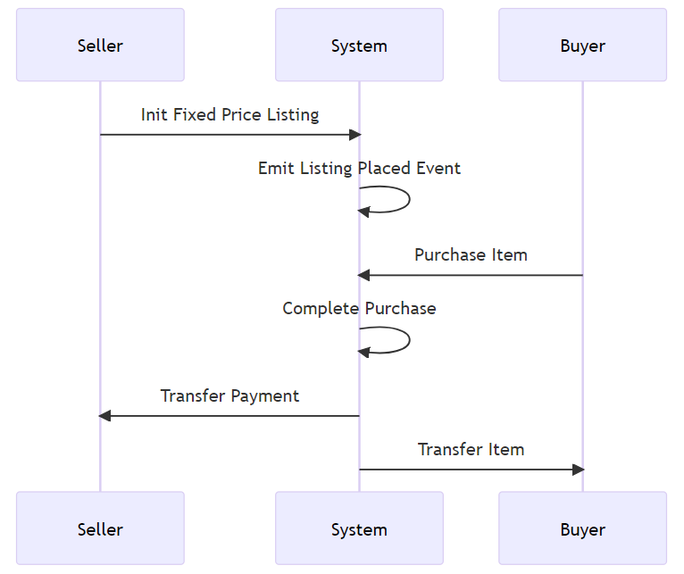
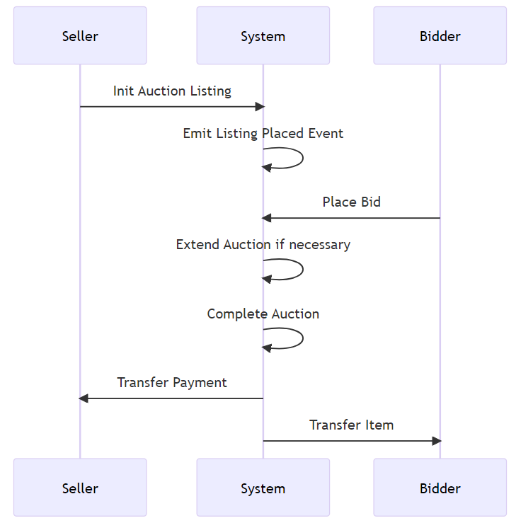

# Marketplace Modules

## Functionalities

- Create NFTs
- NFT Listing
- Combine NFTs
> Combine NFTs should not be limited to the marketplace.
- Auctions
- let me know if I missed a relevant functionality

> we may consider adding renting NFTs in the future.

## Analyzing the existing solutions

### move-examples/marketplace
> There are two branches we need to keep an eye on:
> - master branch
> - marketplace-optimization branch

The following is a high level overview of the marketplace modules in the **master** branch.

- The marketplace consists of the following 6 modules:

#### listing

- Contains the logic for managing the listing.
- Supports Token V1 and Token V2.

> Token V1 is wrapped in a container and dealt as an object. (ignore this for now)

##### what you can do with it 

- Manage listings.
    - Create listing.
    - Update listing.
    - Remove listing.
    - Cancel listing.
- Purchase tokens from listing.

##### what data you can view
> Excluding what you can actually view from the explorer.

- Seller address.
- Listed object. 
- Fee schedule.
- Royalty. 
- Token metadata.

##### how it works (lifecycle)

1. **Initialization:** The `init` function is called by the creator (seller). This function creates a new listing object and transfers the ownership of the listed item to the listing itself. The listing is not live at this point.

2. **Start:** The listing becomes live at the `start_time` specified during initialization. This is when bidding and purchasing can occur.

3. **Bidding/Purchasing:** Once the listing is live, other users can interact with it. For example, they can bid on an auction listing or purchase a fixed-price listing. This is not represented in the code you provided, but it's a crucial part of the lifecycle.

4. **Closing:** The `close` function is called to conclude the listing. This function transfers the listed item to the recipient (buyer) and deletes the listing. The seller and the fee schedule are returned for further processing (e.g., depositing any profit and giving any fees to the marketplace).

> It is important to note that the lifecycle steps are wrapped within the `coin_listing` lifecycle.

_______________________________________________________

#### coin listing

- Contains the logic for the auction.

##### what you can do with it 

- List tokens for sale.
    - Listing can be done in two ways:
        - Fixed price sale. (supports both token V1 and token V2)
        - Auction. (supports both token V1 and token V2) 
        - Buying/selling is not limited to the native coin. (can be done with any coin)
- Purchase tokens from listing.

##### what data you can view
> Excluding what you can actually view from the explorer.

- Price for the object being listed.
- Whether the object is listed for auction or not.
- The starting price for the auction.
- Minimum price for the next bid. (used to set the minimum amount by which the next bid must exceed the current highest bid.)
- The time when the auction is supposed to end.
- The minimum time a bid must be placed before the end of the auction.
- Current bidder. (the account that placed the **current** highest bid) 
- Current bid amount.

##### how it works (lifecycle)

1. **Initialization:** The seller initializes either a fixed price listing or an auction listing. This involves setting the price for a fixed price listing or the starting bid, bid increment, auction end time, minimum bid time before end, and buy it now price for an auction listing. Once the listing is initialized, an event is emitted to indicate that the listing has been placed.

2. **Purchase/Bidding:** For a fixed price listing, a buyer can purchase the item outright. For an auction listing, buyers can place bids. If a bid is placed near the end of an auction, the auction may be extended to give at least minimum_bid_time_before_end time remaining in the auction.

3. **Ending a Listing:** A seller can end a fixed price listing early. An event is emitted to indicate that the listing has been canceled.

4. **Completing an Auction:** Once the current time has elapsed the auction's run time, the auction can be settled by distributing the asset to the winner or the auction seller if no one bid. Any fees are also given to the marketplace that hosted the auction.

5. **Completing a Purchase:** The purchase is completed by distributing the asset to the buyer and transferring the payment to the seller. Any applicable fees and royalties are also deducted.

**Fixed Price Listing:**

**Auction Listing:**

##### Cons
- No admin previliges/access control.
- Probs need more assert functions.

_______________________________________________________

#### collection offer
- Allows users to buy/sell assets within the same collection as a bundle.
- Supports Token V1 and Token V2.

_______________________________________________________

#### fee_schedule

- Contains the fee schedule for the marketplace.
- It might be relevant to investigate the formula for calculating the fee.
TODO investigate the formula for calculating the fee.

_______________________________________________________

#### events

- Contains the events that are emitted when actions/functions are triggered.
- Useful for the frontend to listen to these events and update the UI accordingly.

_______________________________________________________

#### test_utils

- Used for unit testing. (not relevant for this analysis)

_______________________________________________________

#### Licensing

Generated by ChatGPT-4: 

According to the Apache License 2.0, you are allowed to use the code. However, there are certain conditions you must adhere to:

1. You must give appropriate credit, provide a link to the license, and indicate if changes were made. You may do so in any reasonable manner, but not in any way that suggests the licensor endorses you or your use.

2. If you modify the code and distribute it, you must include a copy of the license, state changes you've made, and keep all original copyright, patent, trademark, and attribution notices.

3. You cannot use the names, trademarks, service marks, or product names of the Licensor for endorsement or promotion of your derivative works without specific prior written permission.

4. If you distribute the code, whether modified or not, you must provide recipients with a copy of this license.
_______________________________________________________

#### Q&A
> Feel free to add more questions and I will asnwer them.

- What does the marketplace actually list?
    - The marketplace lists Token V1 and Token V2.

- What is the difference between `listing.move` and `coin_listing.move`?
    - `listing.move` is responsible for managing the listing. `coin_listing.move` is responsible for the auction, but also contains functionalities for the listings (which is a bit weird).

- What is the business model of the marketplace?
    - The marketplace takes a fee from the seller when the listing is sold. The fee is calculated using the `fee_schedule.move` module. 

- Is combining NFTs functionality implemented?
    - No.
    
- Is combining NFTs functionality achievable?
    - Yes! It is achievable. The marketplace can be extended to support this functionality. However, combining NFTs should not be limited to the marketplace.

- What is meant by semantic?
    - TODO

_______________________________________________________

### TokenBound

TODO

_______________________________________________________

## Conclusion

- The marketplace is a good starting point for our project.
- The marketplace can be extended to support the functionalities we need.
- Combining Tokens functionality should be implemented not only in the marketplace.

## Roadmap
- [ ] Investigate the licensing in Aptos-core repo.
- [ ] Implement a marketplace using the marketplace in Aptos-core as a starting point.
- [ ] Implement combining NFTs functionality.
- [ ] Deploy on testnet.
- [ ] Audit the modules. **(This is a must before deploying on mainnet)**